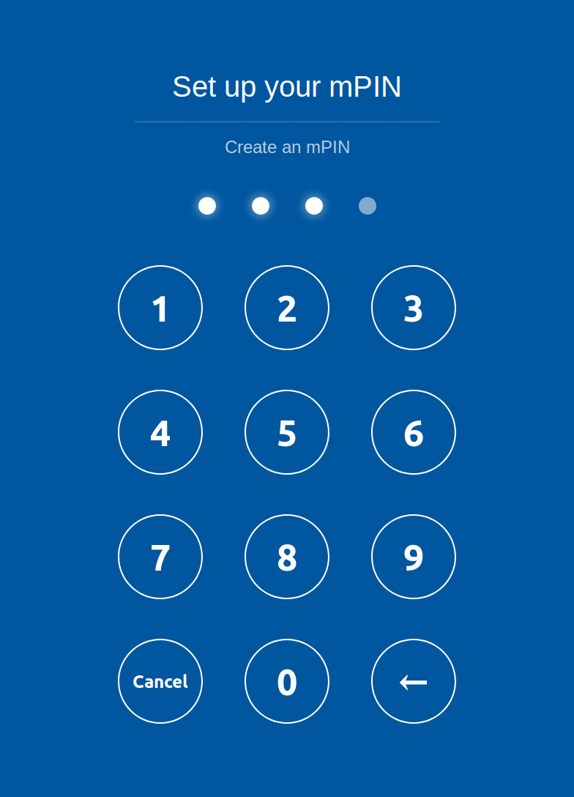

# mPIN OAuth form

Simple HTML form for mPIN creation and confirmation.  
Form is used for OAuth 2.0 authorization process.  
Mainly targets mobile clients but should work properly on other platforms too.

## Try now

You can try mPIN form on https://mors741.github.io/mpin-oath-form/

## Inspired by
https://github.com/dacer/ios7lockscreen-like-ios-web-app
